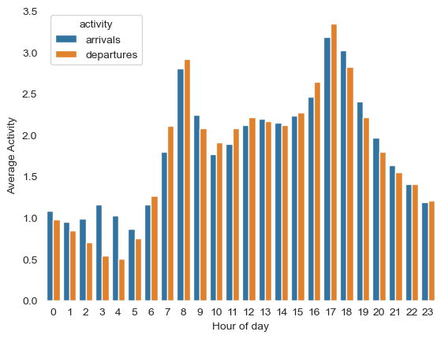

# Capitol Bikeshare
This repository contains my code and data used for predicting bike availability in Washington D.C. using the publicly available [Capital Bikeshare](https://s3.amazonaws.com/capitalbikeshare-data/index.html) dataset. This was originally a project for my Master's program that I then completed on my own time and increasing the scale of the project. The final presentation can be found [here](./results/capital_bikeshare_presentation.pdf).

## Data collection
The [processing](./code/processing.ipynb) notebook details the code that was used to collect the data from publicly available sources

## Exploration
The [exploration](./code/exploration.ipynb) notebook shows the steps I took to explore the data and some written analysis about the decisions made based on this exploration.

### Activity

#### Over time

#### Geographically

##### arrivals

##### departures

## Modeling

Based on the results of the exploration, I tested and evaluated multiple machine learning models using predictive modeling best practices including train-test splits, hyperparameter tuning, and cross-validation. The results of the modeling can be found [here](./code/modeling.ipynb).

### Variable Relationships

### XGBoost Modeling Results

#### Errors

