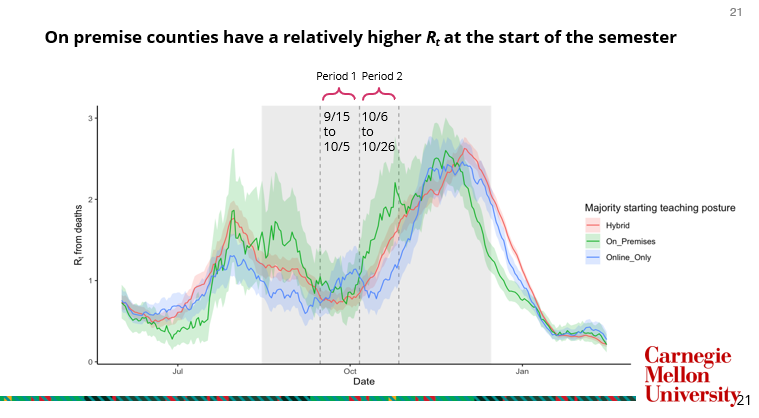
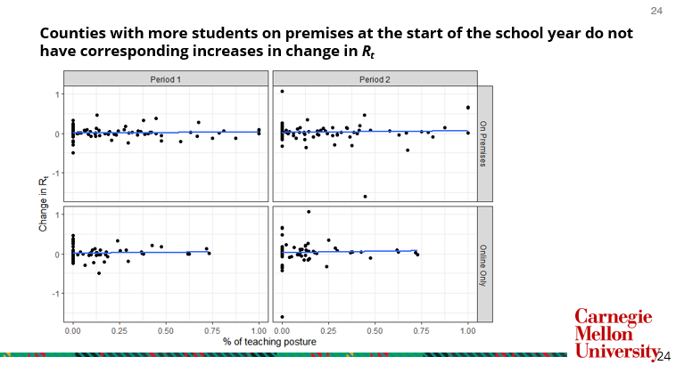

# PHIGHT COVID Capstone Project: MSP Class of 2022
- Authors: Daniel Nason, Wei-Yu Tseng, Julia Keating, Ziyan Wang, Hongsheng Xie
- Advisor: Valeria Ventura, Carnegie Mellon University Department of Statistics and Data Science
- Collaborators: [PHIGHT COVID](https://phightcovid.org/), Lakdawala Lab, University of Pittsburgh

## Deliverables

Check out our [presentation](./reports/PHIGHT_COVID_Final_Presentation.pdf) and [final report](./reports/PHIGHT_COVID_final_report.pdf) for a more in-depth explanation.

## Introduction

Building off of the work previous completed by the [MSP Class of 2021](https://github.com/alexazhu/PHIGHT-COVID), we explore the impact of teaching posture on disease transmission. Specifically, we attempt to validate the results from the [article](https://www.medrxiv.org/content/10.1101/2021.07.16.21260464v1.full) based on the project's findings using the methods in [Cori et al. 2013](https://pubmed.ncbi.nlm.nih.gov/24043437/).

## Methods

The effective reproductive report Rt outlined in [Cori et al. 2013](https://pubmed.ncbi.nlm.nih.gov/24043437/) estimates the ratio of the number of new infections generated at a given time to the total infectiousness of infected individuals at the same time. Note that infections need to be inferred through an observable time-series (i.e. cases, deaths) collected based on the disease, which requires a deconvolution in order to estimate Rt. [Miller et al. 2020](https://pubmed.ncbi.nlm.nih.gov/35545230/) detail this process in [Figure 1](https://pubmed.ncbi.nlm.nih.gov/35545230/#&gid=article-figures&pid=figure-1-uid-0):

Due to the volatility in the cases time series, we focus on the deaths time-series despite its smaller sample size due to the reliability of the data collected relative to cases of testing positive.

## Findings

We compare the change in Rt following the start of the school year to determine the impact of teaching posture (i.e. on-premises, online-only, or hybrid) for K-12 students on COVID-19 disease transmission. We split the semester up into two time-periods, as detailed in the following visual:

If there was a relationship between disease transmission and whether students were in school, we would expect to see a strong positive relationship between teaching posture and Rt for on-premises teaching compared to online-only teaching. However, there does not appear to be any difference in the relationship between teaching posture and the change in Rt during the time periods of interest, as seen in the following visuals:

